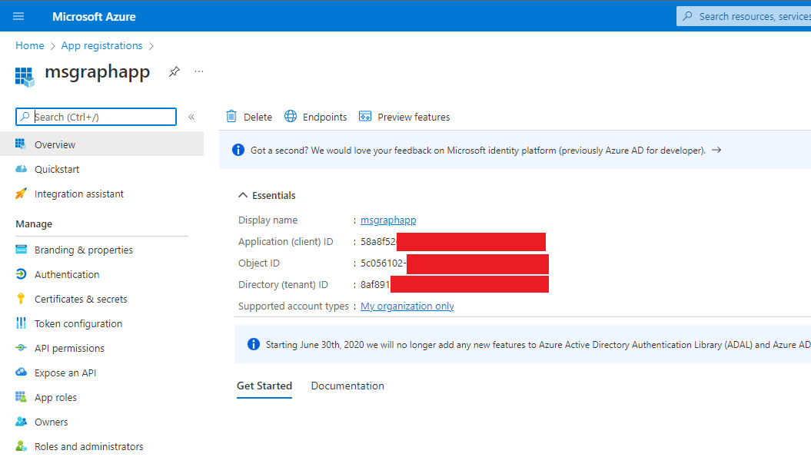
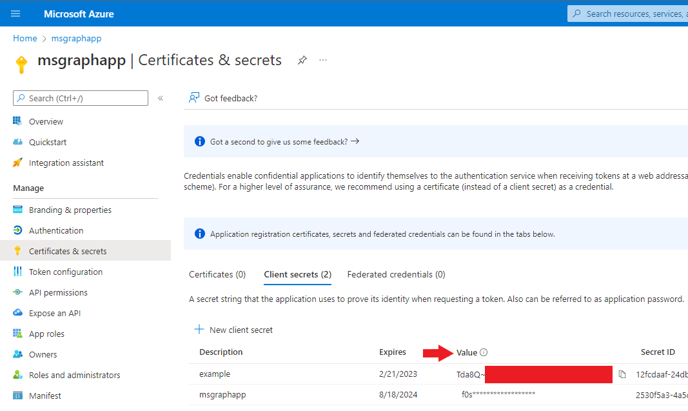

# Authentication and Permissions
This document details all the information you need to know about authenticating with Microsoft and gaining the permissions necessary to perform desired operations.
## Authentication Types
Microsoft has various methods of authentication and permissions management, but this library specifically is for applications that run without any signed-in users present:

This library will only operate using that method of authentication and permissions. If you're looking to do some Graph API work with Python and want to use one of the other authentication types, I recommend the [O365 library for Python](https://github.com/O365/python-o365), another open source Graph API wrapper that provides support for all authentication types. They also implement many of the same endpoints as this library, but the goal of this library is to provide a cleaner implementation of this authentication type specifically.

## Application Registration and Credentials
In order to authenticate with Microsoft, an administrator in the Microsoft organization be operated on needs to create an app registration in [the Microsoft Azure Portal](https://azure.microsoft.com/en-us/get-started/azure-portal/) and acquire the **Client ID**, **Tenant ID**, and **Client Secret** values associated with said registration.

1. Log into the [Microsoft Azure Portal](https://azure.microsoft.com/en-us/get-started/azure-portal/)
2. Go to the 'App registrations' page
3. Go to 'New registration'
4. Give your registration a name, and select the appropriate supported account types (the default selection is fine if you're unsure)
   * With this authentication type, the redirect URI is not required
5. Select 'Register'. This will take you to the overview page of your registration, where you can see the **Client ID** and **Tenant ID** values you need:

6. Go to 'Certificates & secrets' on the menu on the left
7. Select 'New client secret', give it a name and lifespan (maximum of 2 years), and select 'Add'
8. The page will display your new **Client Secret** value. **Be sure to copy this value now, as you can see, once leaving this page it will no longer be visible to any user:**

9. You now have all three required values for authentication.
